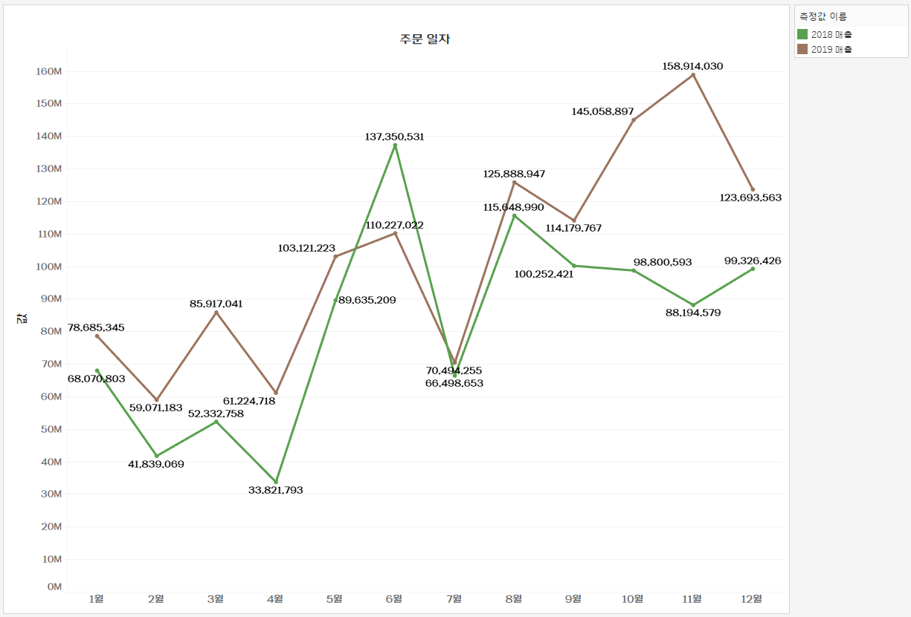
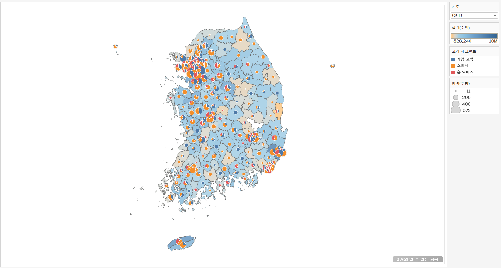
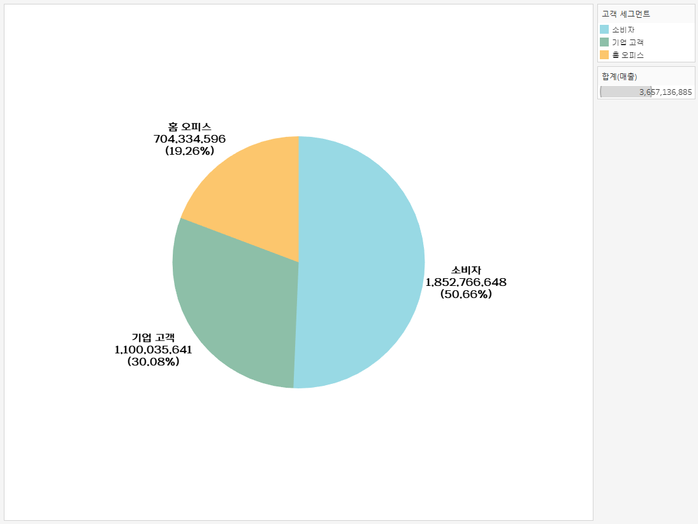

# 1. 고객별 재구매 시기 데이터 분석 태블로 시각화

이 그래프는 고객별 두 번째 구매까지 걸린 날짜(구간 단위)와 고객들의 교차 카운트를 나타냅니다. 각 막대는 특정 구간에 해당하는 고객 수를 보여주며, 높이가 높을수록 그 구간에 해당하는 고객의 재구매 비율이 높은 것을 의미합니다. 

예를 들어, 그래프에서 100일 구간에 해당하는 막대는 고객들이 두 번째 구매까지 걸린 평균 기간이 100일임을 나타내며, 교차 카운트는 14명입니다.

# 2. 고객 세그먼트별 매출액 추이 그래프

# 3. 고객세그먼트별 매출액 누적 막대 그래프

# 4. 년도별 매출액 영역차트

# 5. 월별 매출액 라인 그래프 년도 비교 

# 6. 라운드형 막대 그래프를 다음과 같이 지역별 매출액 합계

# 7. 평균라인이 있는 막대 그래프

# 8. 제품 계층 그래프

# 9. 지도 그래프

# 10. 지도 그래프

# 11. 수익 수량 그래프

# 12. 막대 라인 그래프

# 13. 지도 파이 그래프

# 14. 수도권과 기타 지역 매출 영역 그래프 

 

# 15. 고객별 매출 순위 그래프 

 

# 16. 박스 플롯 그래프
 

# 17. 파이 차트 그래프 

 

# 18. 도넛 차트 그래프 

 

# 19. 산포도 그래프

 

# 20. 트리맵 그래프

 

# 21. 대쉬보드 그래프

 

# 22. 차이 그래프

 

# 23. 두 개의 라인 그래프

 

# 24. 라인 하이라이트 그래프

 

# 25. 챗 지피티 이후 일자리의 변화

 
